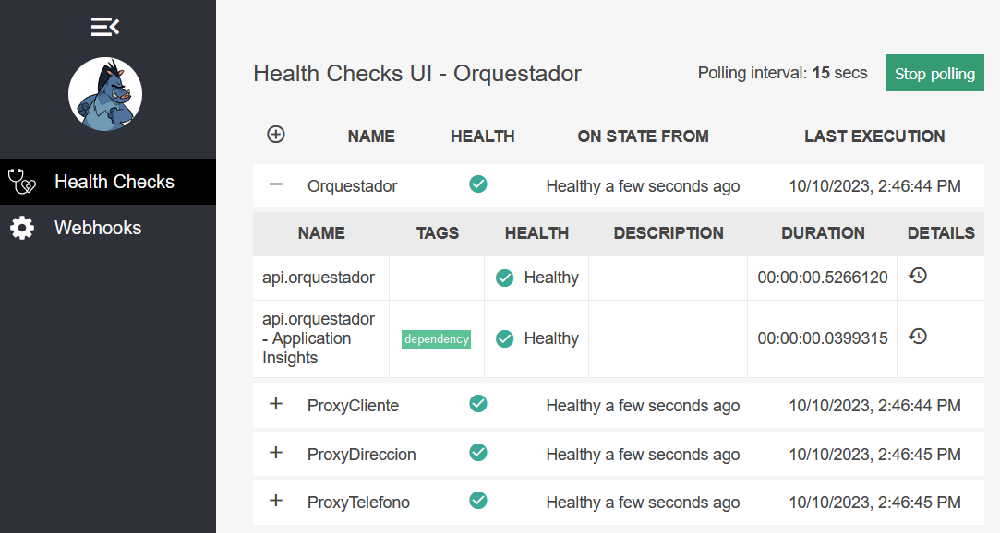

# Heart

Esta carpeta contiene la lógica para la implementación de un endpoint de healthcheck. Para ello se ha creado la clase [ApiHealth.cs](../src/comun/hearth/Logica/ApiHealth.cs) que es la encargada de devolver información de la aplicación, como ser uso del CPU y memoria. Para que funcione correctamente es necesario llamar al método `AddCustomApiHealth` de la extensión [ApiHealthExtensions.cs](../src/comun/hearth/Extensiones/ApiHealthExtensions.cs) que registra el healthcheck en el contenedor de dependencias.

Aquí se utiliza la librería [HealthChecks.Extensions](https://www.nuget.org/packages/HealthChecks.Extensions) para determinar programáticamente si un healthcheck debe ejecutarse no.

Por ejemplo, se utiliza el método `CheckOnlyWhen` para ver la base de datos a utilizar es en memoria, y si es así, no se ejecuta el healthcheck de la base de datos.

```csharp
.AddSqlServer(
    name: $"{apiHealthSettings.NombreServicio} - DB",
    connectionString: apiHealthSettings.UrlBaseDatos,
    tags: new[] { "dependency" }).CheckOnlyWhen($"{apiHealthSettings.NombreServicio} - DB", !useInMemory)
```

La clase [ApiHealth.cs](../src/comun/hearth/Logica/ApiHealth.cs) también cuenta con dos métodos para obtener la información de la aplicación: `GetCpuUsage` y `GetMemoryUsage`. Estos métodos utilizan la librería [System.Diagnostics](https://docs.microsoft.com/en-us/dotnet/api/system.diagnostics?view=net-5.0) para obtener la información del CPU y memoria.

La información de los healthchecks se puede consultar en los siguientes endpoints:

## Orquestador

- Orquestador Health UI: https://localhost:7100/health-ui/
  - Utiliza una interfaz de usuario para mostrar la información de los healthchecks



- Orquestador Health API: https://localhost:7100/health-api/
  - Devuelve la información de los healthchecks en formato JSON

## Microservicios

- Clientes Health: https://localhost:7101/healthz/
- Direcciones Health: https://localhost:7102/healthz/
- Teléfonos Health: https://localhost:7103/healthz/