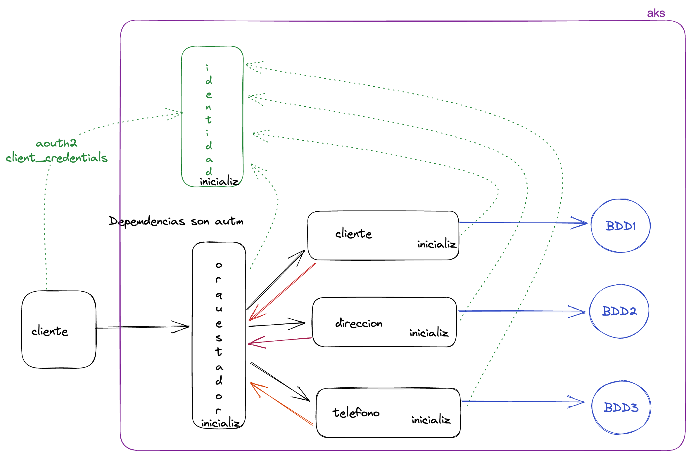

# Demo Orquestador

La aplicación cuenta con 4 API: 1 que actúa como orquestador y 3 (cliente, dirección y teléfono) para simular tres
microservicios.



## Tecnologías utilizadas

- .NET 8
- ASP.NET Core 8
- Serilog
- Application Insights SDK
- EntityFramework Core 8
- Polly
- stateless
- Bogus
- HealthChecks
- OpenIddict

## Hosts - DNS
Se debe configurar el archivo de hosts para resolver los dominios: 
- 127.0.0.1       iam.arquitectura.com
- 127.0.0.1       cliente.arquitectura.com
- 127.0.0.1       direccion.arquitectura.com
- 127.0.0.1       telefono.arquitectura.com
- 127.0.0.1       orquestador.arquitectura.com

## Deploy
1. ejecutar los siguientes comandos make que requieren privilegios elevados
  ```shell
  make docker-cliente
  make docker-direccion
  make docker-telefono
  make docker-orquestador 
  ```
## Ejecutar
Para correr los contenedores existe un archivo Compose.yaml, pero antes de ejecutar es **indispansable que la imagen del servicio de identidad este generada**
```shell
  docker compose up
  ```
## Urls

- Orquestador: https://orquestador.arquitectura.com:7100
- Orquestador Health UI: https://orquestador.arquitectura.com:7100/health-ui/
- Orquestador Health API: https://orquestador.arquitectura.com:7100/health-api/
- Clientes API: https://cliente.arquitectura.com:7200
- Clientes Health: https://cliente.arquitectura.com:7200/healthz/
- Direcciones API: https://direccion.arquitectura.com:7300
- Direcciones Health: https://direccion.arquitectura.com:7300/healthz/
- Teléfonos API: https://telefono.arquitectura.com:7400
- Teléfonos Health: https://telefono.arquitectura.com:7400/healthz/

## Orquestador

El orquestador es el punto de entrada de la aplicación, recibe las peticiones del cliente y las distribuye a los
microservicios correspondientes. Realiza esta tarea haciendo uso de la librería stateless que permite crear máquinas de
estado.

El
control [OrquestacionClienteController.cs](src/orquestador/api.orquestador/Controllers/OrquestacionClienteController.cs)
cuenta con los endpoints para guardar un cliente, obtener un cliente especifico, obtener todos los clientes y eliminar
un cliente.

La lógica principal del orquestador se encuentra en el
servicio [ConexionManager.cs](src/orquestador/api.orquestador/Servicios/ConexionManager.cs). Esta clase hace uso de los
proxys de cada API para realizar las peticiones correspondientes.

### Crear cliente

El método `CrearCliente` se encarga de crear un cliente, para ello realiza los siguientes pasos:

1. Primero crea una máquina de estado que se encarga de realizar las peticiones a cada microservicio. La máquina de
   estado se crea con el estado inicial `SinIniciar`.
2. Cuando la acción `CrearCliente` es activada, se llama al proxy de clientes almacenar el nuevo cliente. Este retorna
   la información del cliente creado en forma de un string y lanza la acción `ClienteCreado`.
3. Una vez que se ha creado el cliente exitosamente, se llama al proxy de direcciones para almacenar la dirección del
   cliente. Este retorna la información de la dirección creada en forma de un string y lanza la
   acción `DireccionCreado`.
4. De la misma manera, una vez creada la dirección se llama al proxy de teléfonos para almacenar el teléfono del
   cliente. Este retorna la información del teléfono creado en forma de un string y lanza la acción `TelefonoCreado`.

Al final se retorna un objeto con los tres datos creados.

- Ejemplo json del request que acepta el orquestador:

```json
{
  "name": "Pedro",
  "lastName": "Perez",
  "dateBirth": "1980-08-28T13:54:59.440Z",
  "numero": "123456789",
  "tipo": 1,
  "operadora": 1,
  "provincia": "lorem ipsum",
  "canton": "lorem ipsum",
  "callePrincipal": "lore ipsum"
}
```

- Y ejemplo de la respuesta:

```json
{
  "cliente": {
    "Id": "67705c40-d23e-421d-ab24-de9defe0bdcb",
    "Name": "Pedro",
    "LastName": "Perez",
    "DateBirth": "1980-08-28T13:54:59.44Z",
    "Links": [
      {
        "href": "https://localhost:7200/api/v1.0/Clientes/67705c40-d23e-421d-ab24-de9defe0bdcb",
        "rel": "self",
        "method": "GET"
      },
      {
        "href": "https://localhost:7200/api/v1.0/Clientes/67705c40-d23e-421d-ab24-de9defe0bdcb",
        "rel": "delete",
        "method": "DELETE"
      },
      {
        "href": "https://localhost:7200/api/v1.0/Clientes",
        "rel": "post",
        "method": "POST"
      }
    ]
  },
  "direccion": {
    "Id": "d23bcde6-821c-45a6-a0b6-fbef3ee9151a",
    "IdCliente": "67705c40-d23e-421d-ab24-de9defe0bdcb",
    "Provincia": "lorem ipsum",
    "Canton": "lorem ipsum",
    "CallePrincipal": "lore ipsum",
    "Links": [
      {
        "href": "https://localhost:7300/api/v1.0/Direcciones/d23bcde6-821c-45a6-a0b6-fbef3ee9151a",
        "rel": "self",
        "method": "GET"
      },
      {
        "href": "https://localhost:7300/api/v1.0/Direcciones/d23bcde6-821c-45a6-a0b6-fbef3ee9151a",
        "rel": "delete",
        "method": "DELETE"
      },
      {
        "href": "https://localhost:7300/api/v1.0/Direcciones",
        "rel": "post",
        "method": "POST"
      }
    ]
  },
  "telefono": {
    "Id": "600da6b5-5cfa-4dbe-a63a-c70a2654eedd",
    "IdCliente": "67705c40-d23e-421d-ab24-de9defe0bdcb",
    "Numero": "123456789",
    "Tipo": 1,
    "Operadora": 1,
    "Links": [
      {
        "href": "https://localhost:7400/api/v1.0/Telefonos/600da6b5-5cfa-4dbe-a63a-c70a2654eedd",
        "rel": "self",
        "method": "GET"
      },
      {
        "href": "https://localhost:7400/api/v1.0/Telefonos/600da6b5-5cfa-4dbe-a63a-c70a2654eedd",
        "rel": "delete",
        "method": "DELETE"
      },
      {
        "href": "https://localhost:7400/api/v1.0/Telefonos",
        "rel": "post",
        "method": "POST"
      }
    ]
  }
}
```

### Dependencias

Ver: [Lista de Dependencias](Docs/Dependencias.md)

## Microservicios

Todos los microservicios cuentan con la misma estructura, cada uno cuenta con un controlador, un repositorio, un
DbContext y un servicio helper que facilita la implementación de HETOAS.

Cada microservicio tiene la opción de utilizar una base de datos en memoria o una base de datos SQL Server. Para utilizar una base de datos en memoria, se debe cambiar el valor de la variable de configuración `UseInMemoryDatabase` en el archivo `appsettings.json` de cada microservicio. Para utilizar una base de datos SQL Server, el string de conexión debe ser configurado en el archivo `appsettings.json` de cada microservicio.

### API Clientes

Esta API se encarga de gestionar los clientes, permite crear, actualizar, eliminar y consultar clientes.

#### Endpoints

- GET /api/v1.0/Clientes - Obtiene todos los clientes
- POST /api/v1.0/Clientes - Crea un cliente
- GET /api/v1.0/Clientes/{id} - Obtiene un cliente específico
- PUT /api/v1.0/Clientes/{id} - Actualiza un cliente específico
- DELETE /api/v1.0/Clientes/{id} - Elimina un cliente específico

### API Direcciones

Esta API se encarga de gestionar las direcciones de los clientes, permite crear, actualizar, eliminar y consultar
direcciones.

#### Endpoints

- POST /api/v1.0/Direcciones - Crea una dirección
- GET /api/v1.0/Direcciones/all - Obtiene todas las direcciones
- GET /api/v1.0/Direcciones/cliente/{id} - Obtiene todas las direcciones de un cliente
- DELETE /api/v1.0/Direcciones/cliente/{id} - Elimina todas las direcciones de un cliente
- GET /api/v1.0/Direcciones/{id} - Obtiene una dirección específica
- PUT /api/v1.0/Direcciones/{id} - Actualiza una dirección específica
- DELETE /api/v1.0/Direcciones/{id} - Elimina una dirección específica

### API Teléfonos

Esta API se encarga de gestionar los teléfonos de los clientes, permite crear, actualizar, eliminar y consultar
teléfonos.

#### Endpoints

- POST /api/v1.0/Telefonos - Crea un teléfono
- GET /api/v1.0/Telefonos/all - Obtiene todos los teléfonos
- GET /api/v1.0/Telefonos/cliente/{id} - Obtiene todos los teléfonos de un cliente
- DELETE /api/v1.0/Telefonos/cliente/{id} - Elimina todos los teléfonos de un cliente
- GET /api/v1.0/Telefonos/{id} - Obtiene un teléfono específico
- PUT /api/v1.0/Telefonos/{id} - Actualiza un teléfono específico
- DELETE /api/v1.0/Telefonos/{id} - Elimina un teléfono específico

### Dependencias de los microservicios

Ver: [Lista de Dependencias](Docs/Dependencias.md)

## Proyecto shared.comun

Este proyecto contiene las clases comunes a todos los proyectos de la solución.

### Authentication

Ver: [Autenticación](Docs/Autenticacion.md)

### Telemetry

Ver: [Telemetría](Docs/Telemetria.md)

### HETOAS

Aquí se encuentra la implementación de HATEOAS para los microservicios, además de las clases necesarias para paginación,
ordenamiento y filtrado. La clase [QueryStringParameters.cs](src/comun/hetoas/QueryStringParameters.cs) es utilizada para
obtener los parámetros de la query string del request.

Para detalles específicos de la implementación,
ver: [Implementación](https://code-maze.com/hateoas-aspnet-core-web-api/)

### Heart

Ver: [Heart](Docs/Heart.md)

### EntityFramework

Contiene la configuración de EntityFramework para la conexión a la base de datos o una base de datos en memoria. Cuenta
con un método de extensión genérico para registrar la configuración en el contenedor de
dependencias [DbContextExtensions.cs](src/comun/EntityFramework/Extensions/DbContextExtensions.cs).

También cuenta con la implementación de un repositorio
genérico [Repository.cs](src/comun/EntityFramework/GenericRepository.cs) que permite realizar las operaciones básicas sobre
una entidad.

### Dependencias

Ver: [Lista de Dependencias](Docs/Dependencias.md)

## Tests

### JMeter Tests

Se han creado algunos tests de carga utilizando JMeter. Estos se encuentran en la carpeta [JMeter](JMeter).

### Unit Tests

Se han creado algunos tests unitarios utilizando xUnit. Estos se encuentran en su mayoría en el proyecto `shared.comun.tests`.

También se han creado algunos tests de specsflow para probar los controles de los microservicios. Estos se encuentran en el proyecto `api.controllers.specsflow`.

Adicionalmente, se ha creado una colección de Postman para probar los endpoints de los microservicios. Esta se encuentra en la carpeta [Postman](Postman).
